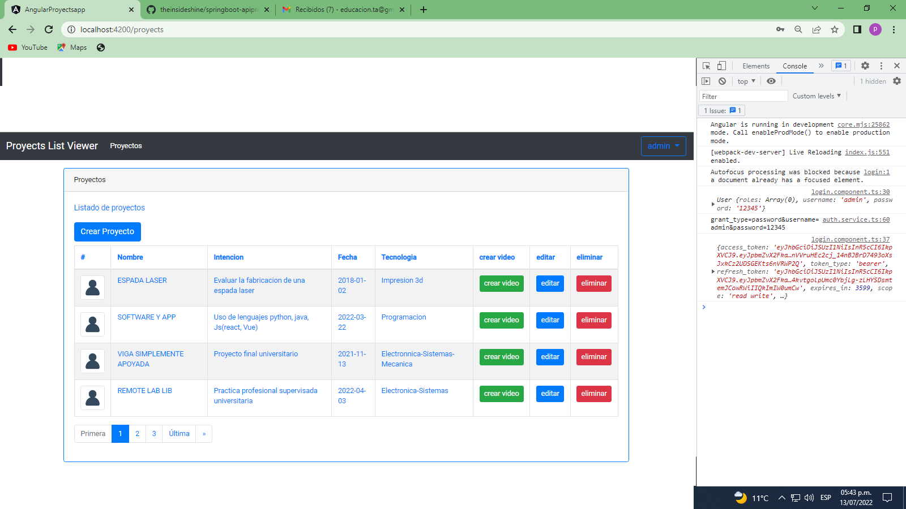
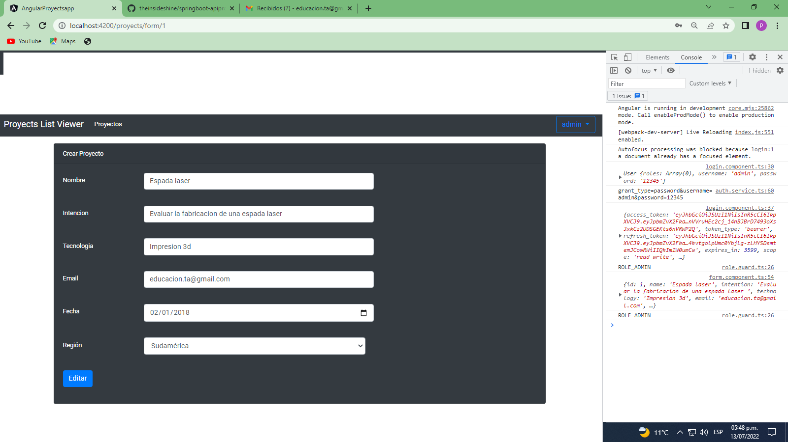
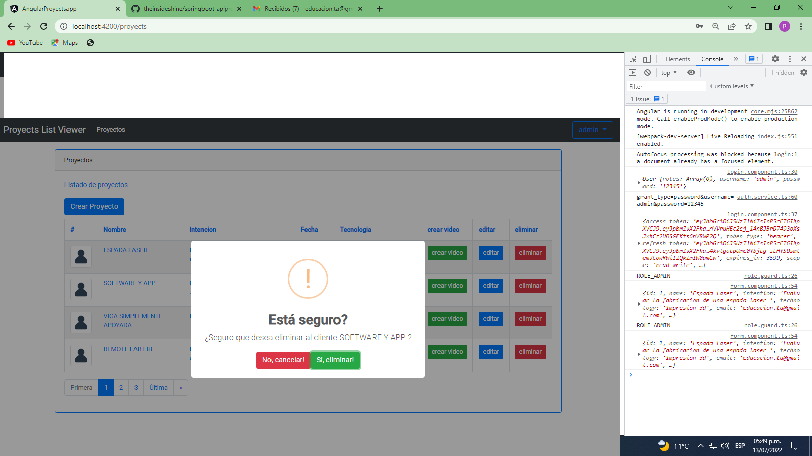
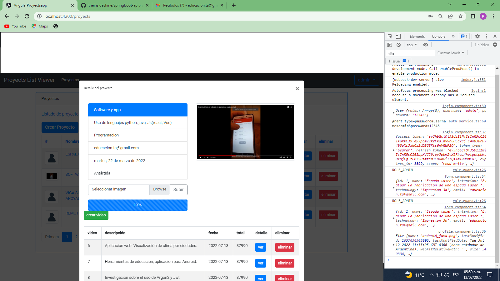
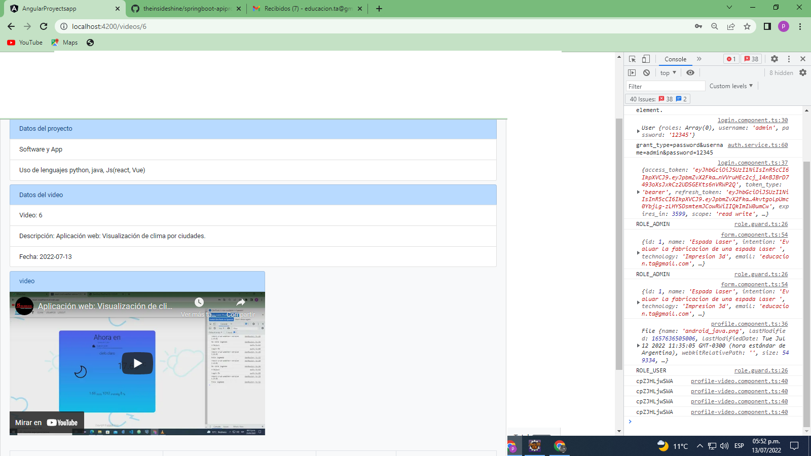
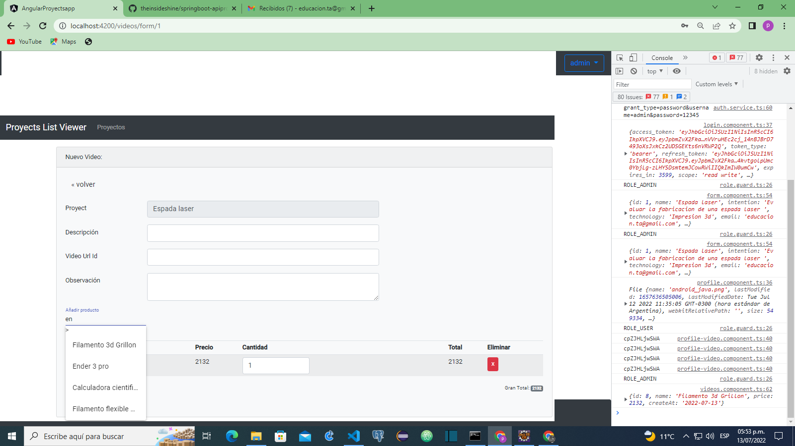
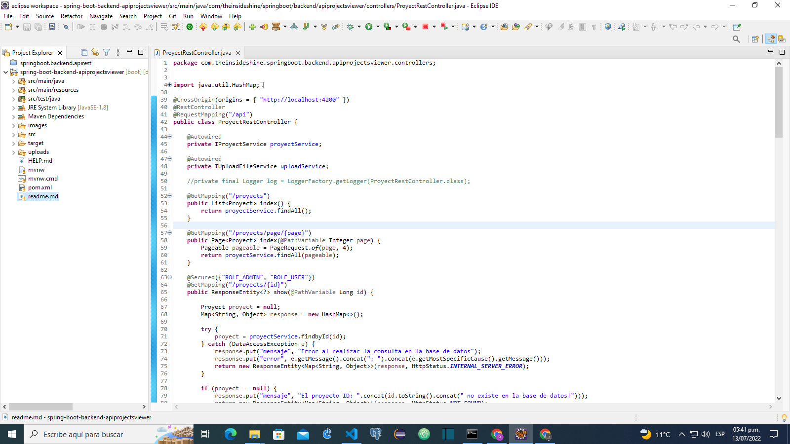

# SpringBoot-apiproyects

La intención del proyecto es familiarizarse con el uso de SpringBoot , SpringSecurity
, Spring data jpa, y angular

[Intencion del proyecto](https://youtu.be/-bFDZmKrt8A)

[demo de uso-EN CONSTRUCCION](https://youtu.be/-bFDZmKrt8A)

Lista principal de proyectos

Formulario de creacion/edicion de proyectos

Borrado de proyectos

Perfil del proyecto

Detalles del video

Crear video

Spring/Eclipse

